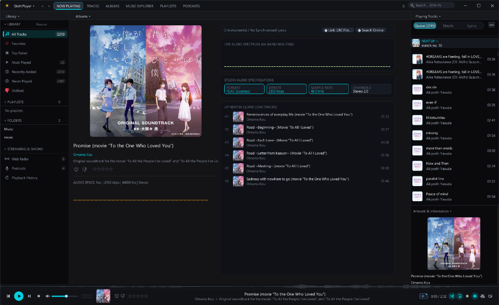
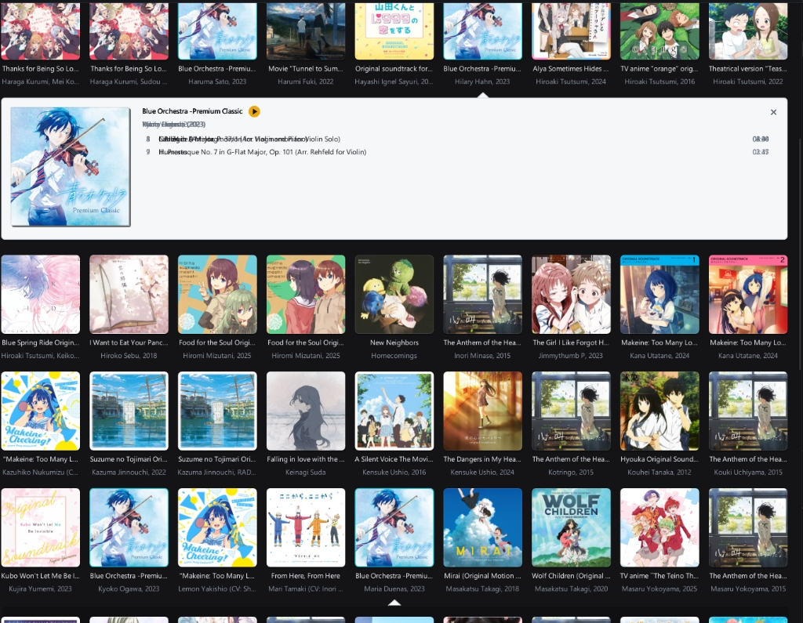
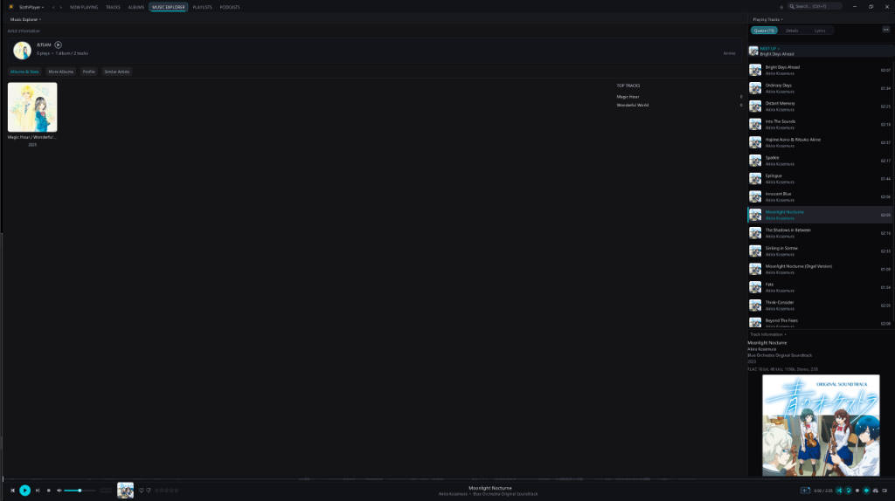

# SlothPlayer - Modern Desktop Audio Player in C++

[](https://en.wikipedia.org/wiki/C%2B%2B20)
[](https://docs.microsoft.com/en-us/windows/win32/direct3d11/atcon-effects)
[](https://github.com/ocornut/imgui)
[](https://www.microsoft.com/windows)
[](https://github.com/sidhantjohnaind/SlothPlayer/releases)

A high-performance, native Windows C++ desktop music player and audio library manager inspired by MusicBee and modern audio workstations.

Built with **DirectX 11**, **Dear ImGui**, and a low-latency WASAPI **miniaudio** engine. 100% standalone and portable without external runtime dependencies.

---

## 📸 Screenshots

### 1. Now Playing Stage & Realtime Spectrum Visualizer
Full dark theater view with high-resolution artwork, live 32-band audio spectrum analyzer, studio audio format specifications (FLAC/Lossless, bitrate, sample rate, channels), queue management, and interactive lyrics bar.



---

### 2. Albums Covers Grid & Interactive Discography
Responsive high-fidelity album art grid with anisotropic sampling, negative LOD bias for ultra-crisp scaling, and expandable inline tracklist popups.



---

### 3. Music Explorer & Artist Overview
In-depth artist discography browser with album catalogs, top tracks, metadata inspection, and instant play queues.



---

## ⚡ Features

### 1. Multi-Panel Dark UI
- **Top Menu & Global Instant Search**: Filter tracks across title, artist, album, and genre in real-time.
- **Left Panel (Library Navigator & Sources)**:
  - Library categories: *All Tracks*, *Favorites*, *Top Rated*, *Most Played*, *Recently Added*, *Never Played*, *Disliked*.
  - Playlists manager: Create, rename, delete custom playlists, export to `.m3u`.
  - Folder Explorer: Monitored local music folders with directory tree and background watcher.
  - Streaming & Radio: Web Radio presets and Podcast manager.
- **Center Panel (Main Views)**:
  - **Now Playing Theater**: Large artwork drop shadow, 32-band spectrum analyzer, audio specifications badges, up next queue.
  - **Tracks View**: Multi-column sortable table with Status icons, Track #, Title, Artist, Album, Duration, Genre, and Year. Double-click to play, right-click context menu (Play, Play Next, Queue, Favorite, Playlist, Properties).
  - **Album Covers Grid**: Responsive grid of album art cards with metadata and track count.
  - **Artists View**: Artist discography browser.
  - **Folder Browser**: Direct file browsing and playback.
- **Right Panel (Track Info, Queue & Visualizer)**:
  - High-resolution album artwork display (with procedural vinyl record fallback if no cover art exists).
  - Track metadata & format badge (bitrate, sample rate, channels).
  - **Live Real-Time Audio Visualizer**: 32-band animated spectrum analyzer and stereo L/R VU meters driven directly by the audio output stream.
  - Now Playing Queue with drag/click to play.
- **Bottom Transport Bar**:
  - Mini album art cover, track title, artist, album, and favorite star toggle.
  - Playback controls: Shuffle, Previous, Play/Pause, Stop, Next, Repeat mode (Off / All / One).
  - Interactive Scrubber: Elapsed time, draggable progress slider, total duration.
  - Volume control with mute toggle.
  - Quick **EQ** launcher button.

### 2. 10-Band Graphic DSP Equalizer
- **10 Frequency Bands**: 31Hz, 63Hz, 125Hz, 250Hz, 500Hz, 1kHz, 2kHz, 4kHz, 8kHz, 16kHz.
- **Preamp Gain**: -12dB to +12dB.
- **Biquad Filters**: Real-time peaking IIR filters applied in the playback audio stream.
- **Presets**: Flat, Rock, Pop, Jazz, Classical, Bass Boost, Treble Boost, Vocal Boost, Electronic, Acoustic.

### 3. Audio & Tag Engine
- **WASAPI Playback**: Low-latency native Windows audio output via `miniaudio`.
- **Formats**: MP3, FLAC, WAV, OGG, AAC/M4A, ALAC, AIFF.
- **Tag Extraction**: ID3v1, ID3v2.3/ID3v2.4, and FLAC Vorbis Comments + APIC embedded cover art extraction.
- **Async Artwork Engine**: Multi-threaded asynchronous artwork pipeline with texture caching for instant, zero-lag app startup.
- **Library Persistence**: Fast JSON database cache (`slothplayer_library.json`).

---

## ⌨️ Keyboard Shortcuts

| Shortcut | Action |
|---|---|
| **Space** | Play / Pause |
| **Left / Right** | Seek backward / forward 5 seconds |
| **Ctrl + Left** | Previous Track |
| **Ctrl + Right** | Next Track |
| **Up / Down** | Volume Up / Down (+5% / -5%) |
| **M** | Toggle Mute |
| **Ctrl + E** | Toggle 10-Band Equalizer |

---

## 📦 Downloads & Releases

Pre-compiled standalone portable releases across all major architectures and operating systems are available on the [**Official GitHub Releases**](https://github.com/sidhantjohnaind/SlothPlayer/releases) page:

| Platform / Architecture | Package | Description |
|---|---|---|
| **Windows x64** | [`SlothPlayer-v1.0.0-windows-x64.zip`](https://github.com/sidhantjohnaind/SlothPlayer/releases/download/v1.0.0/SlothPlayer-v1.0.0-windows-x64.zip) | Portable Windows 10/11 Direct3D 11 (Intel / AMD) |
| **Windows ARM64** | [`SlothPlayer-windows-arm64.zip`](https://github.com/sidhantjohnaind/SlothPlayer/releases/download/v1.0.0/SlothPlayer-windows-arm64.zip) | Native Windows on ARM (Snapdragon X Elite / Copilot+ PCs) |
| **Linux x64** | [`SlothPlayer-linux-x64.tar.gz`](https://github.com/sidhantjohnaind/SlothPlayer/releases/download/v1.0.0/SlothPlayer-linux-x64.tar.gz) | Linux x86_64 OpenGL 3.3 / GLFW / ALSA |
| **Linux ARM64** | [`SlothPlayer-linux-arm64.tar.gz`](https://github.com/sidhantjohnaind/SlothPlayer/releases/download/v1.0.0/SlothPlayer-linux-arm64.tar.gz) | Native Linux ARM64 (aarch64 / Raspberry Pi 4/5) |
| **Linux RISC-V 64** | [`SlothPlayer-linux-riscv64.tar.gz`](https://github.com/sidhantjohnaind/SlothPlayer/releases/download/v1.0.0/SlothPlayer-linux-riscv64.tar.gz) | Linux RISC-V (riscv64 / SBCs) |
| **macOS ARM64** | [`SlothPlayer-macos.tar.gz`](https://github.com/sidhantjohnaind/SlothPlayer/releases/download/v1.0.0/SlothPlayer-macos.tar.gz) | Apple Silicon (M1 / M2 / M3 / M4) CoreAudio |

---

## 🛠️ Building Across Platforms

SlothPlayer uses standard CMake 3.20+ and Ninja across all operating systems and architectures.

### Windows (DirectX 11)
```cmd
cmake -B build -G Ninja -DCMAKE_BUILD_TYPE=Release
cmake --build build --config Release
.\build\SlothPlayer.exe
```

### Linux (AMD64, ARM64, RISC-V)
```bash
sudo apt-get install -y ninja-build build-essential libasound2-dev libgl1-mesa-dev libglfw3-dev
cmake -B build -G Ninja -DCMAKE_BUILD_TYPE=Release
cmake --build build --config Release
./build/SlothPlayer
```

### macOS (Apple Silicon & Intel)
```bash
brew install glfw ninja
cmake -B build -G Ninja -DCMAKE_BUILD_TYPE=Release
cmake --build build --config Release
./build/SlothPlayer
```

### Running the Subsystem Test Suite
```cmd
ninja -C build test_audio_library
.\build\test_audio_library.exe
```
